#  Logtime 42 - Extension Chrome Enrichie (Fork)

Une extension Chrome moderne, rapide et ultra-complète pour les étudiants de l'école 42. Ce fork améliore l'expérience originale en ajoutant des fonctionnalités premium directement sur votre profil Intra.

---

## 📋 Sommaire
1. [Installation](#-installation-mode-développeur)
2. [Configuration API](#-configuration-de-lapi-intra-42)
3. [Nouvelles Fonctionnalités Premium](#-nouvelles-fonctionnalités-premium)
4. [Fonctionnalités Classiques](#-fonctionnalités-classiques)
5. [Confidentialité](#-confidentialité)

---

## 🛠️ Installation (Mode Développeur)

1.  **Télécharger le dépôt** : Téléchargez le code en tant qu'archive ZIP et extrayez-le.
2.  **Accéder aux extensions** : Ouvrez Chrome et allez sur `chrome://extensions/`.
3.  **Activer le mode développeur** : Basculez l'interrupteur en haut à droite.
4.  **Charger l'extension** : Cliquez sur **"Charger l'extension non empaquetée"** et sélectionnez le dossier de l'extension.
5.  **Épingler l'extension** : Épinglez "Logtime 42" pour un accès rapide.

---

## 🔑 Configuration de l'API Intra 42

Pour les fonctionnalités avancées (Amis, Outstanding), vous devez configurer vos accès :

1.  Créez une application sur [l'Intra](https://profile.intra.42.fr/oauth/applications/new).
2.  **Redirect URI** : `https://localhost`
3.  Copiez votre **UID** et votre **Secret**.
4.  Ouvrez les **Options** de l'extension et renseignez votre **Login**, **UID** et **Secret**.

---

## ✨ Nouvelles Fonctionnalités Premium

### 📊 Dashboard Profil en Temps Réel
Visualisez instantanément votre logtime du jour et du mois directement en haut de votre profil. Les pastilles s'intègrent parfaitement au design de l'Intra et s'adaptent à vos horaires. Vous remarquerez également l'apparition d'une **magnifique étoile dorée** 🌟 au-dessus de votre avatar si votre Coalition domine actuellement le campus !

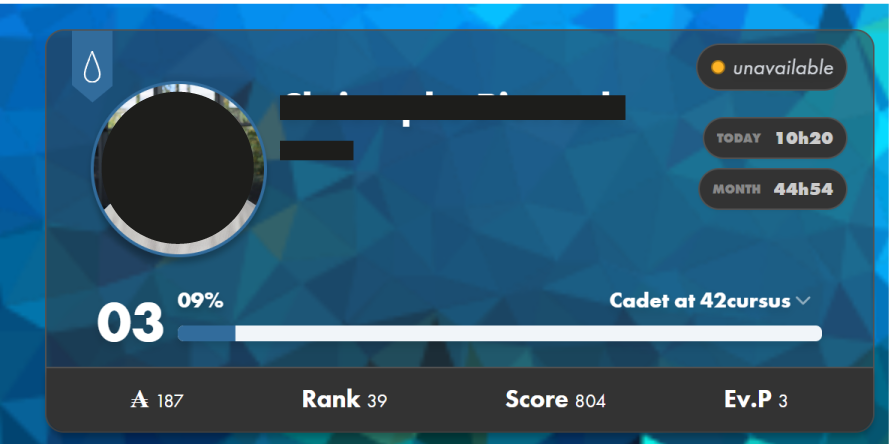

#### 📈 Records Personnels de Connexion
Suivez et pulvérisez vos limites ! L'extension épluche automatiquement votre historique pour extraire et figer vos meilleures performances absolues (Meilleure Journée, Meilleure Semaine et Meilleur Mois) afin de vous motiver au quotidien.

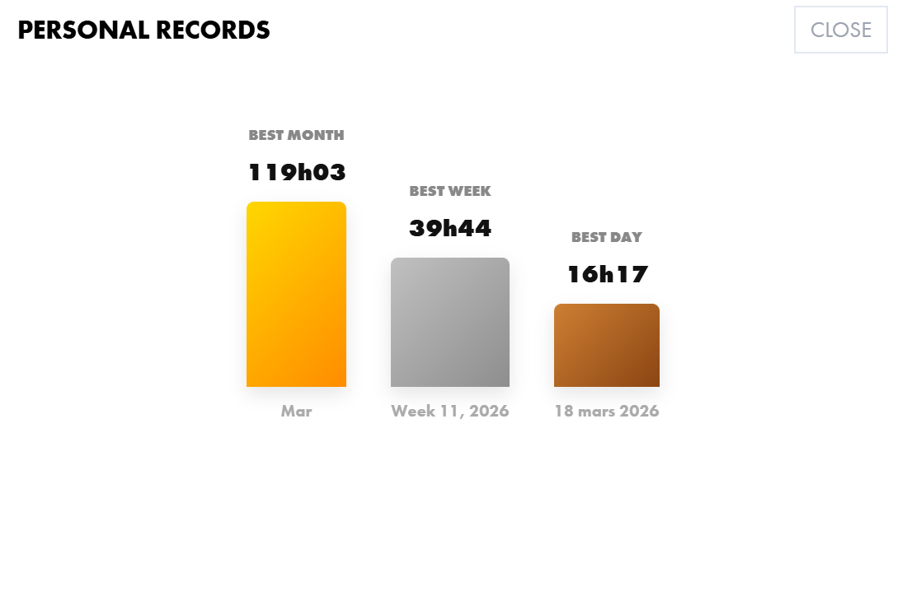

### 👥 Système d'Amis (Coalitions, Wallets & Podiums)
Une toute nouvelle carte interactive pour afficher vos amis avec un design ultra premium :
- **Identité Coalition** : Le logo et la couleur de la coalition de chaque ami s'affichent nativement sur son avatar.
- **Étoile de Leader** : Une magnifique étoile dorée apparaît au-dessus des profils et avatars appartenant à la coalition vainqueur (en tête du campus) !
- **Podiums Interactifs** : Visualisez vos amis s'affronter dans le **Top Logtime**, le **Top Level**, et le **Top Wallet (₳)**.
- **Statut Live** : Voyez en un coup d'œil qui est en ligne, sur quel poste, et comparez vos Wallets.

| Liste d'Amis | Podium Logtime | Podium Level | Podium ₳ | Ajout Amis |
| :---: | :---: | :---: | :---: | :---: |
| 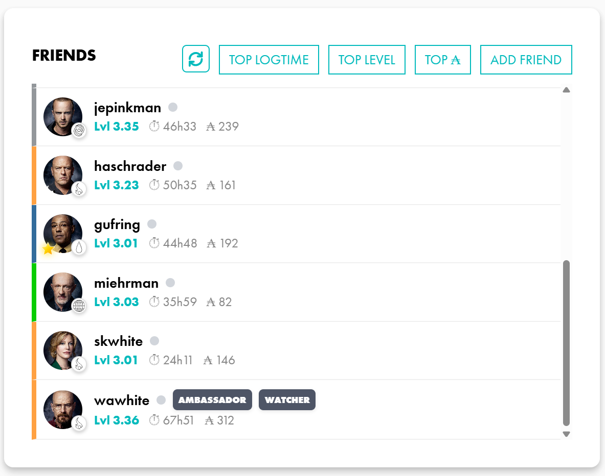 | 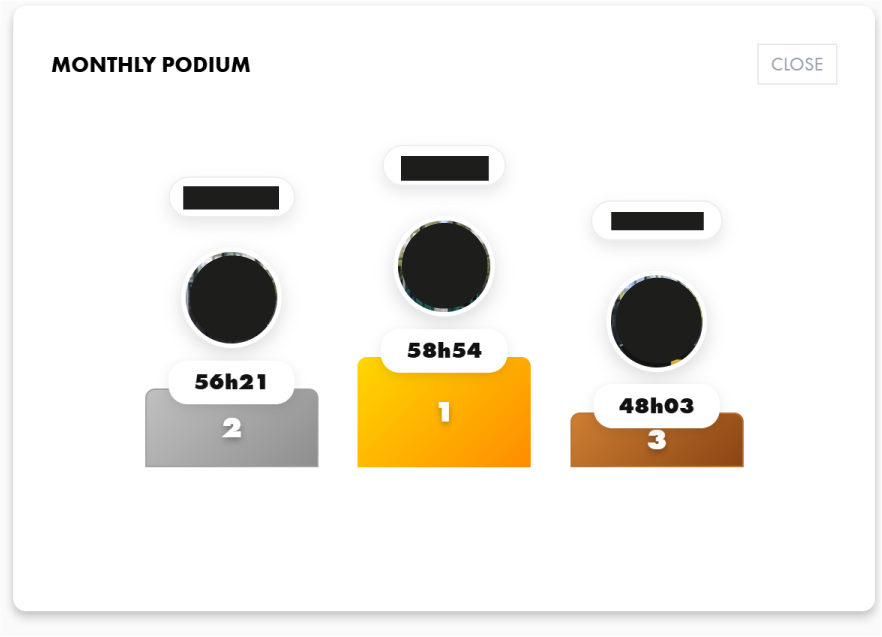 | 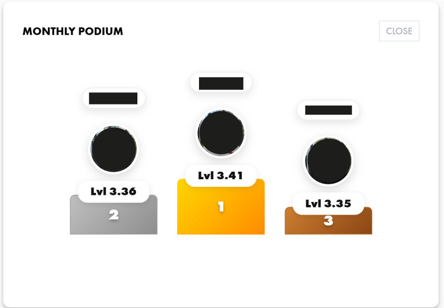 | 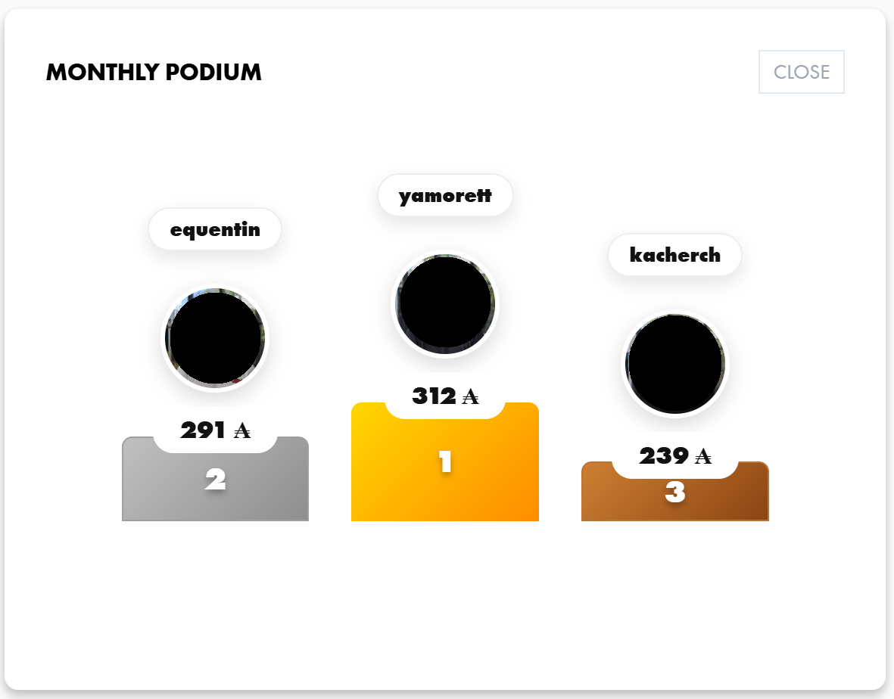 | 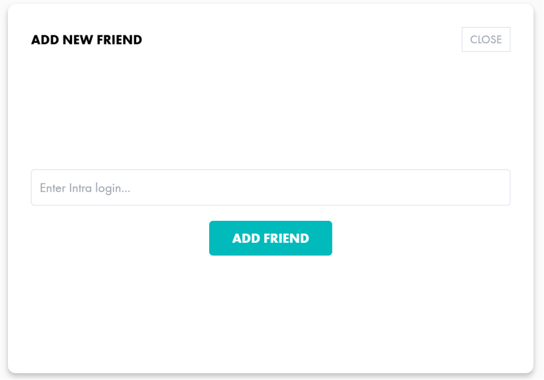 |

### 🏅 Décoration Intelligente des Projets (MARKS)
L'extension analyse vos projets et ceux de vos amis pour appliquer des décorations premium :
- **Or ⭐ (Outstanding)** : Détecté automatiquement via l'API pour célébrer l'excellence.
- **Bleu 🏅 (Bonus)** : Appliqué à tous les projets avec un score supérieur à 100.
- **Rouge 🔥 (Ultra)** : Une décoration spéciale pour les projets cumulant à la fois un Bonus > 100 et une distinction Outstanding.

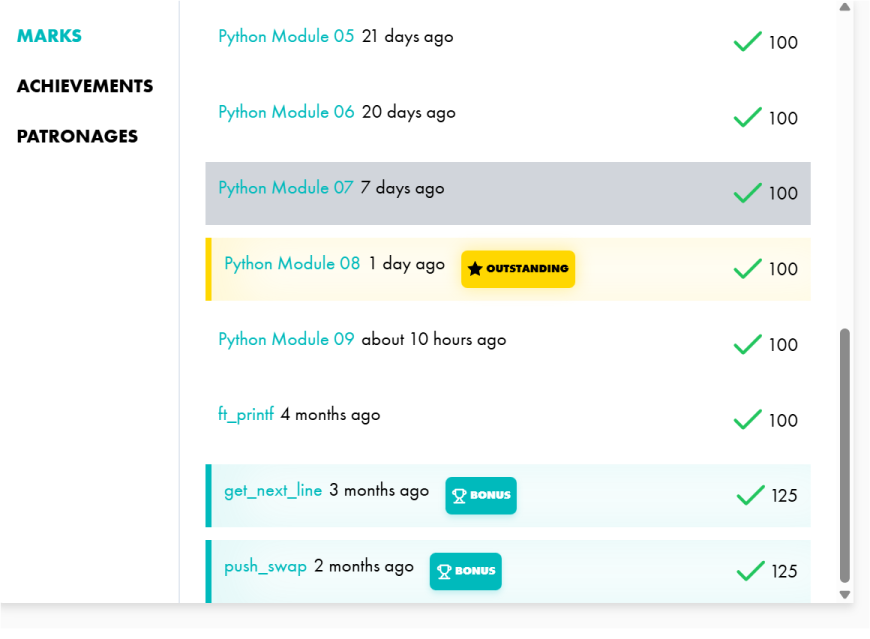

### 🖥️ Raccourci Matrix & Monitoring
- **Icône Header** : Un accès direct à Matrix est intégré directement dans la barre de navigation du header de l'Intra (pour le campus concerné).
- **Live Logtime** : Des informations en temps réel sur l'occupation des clusters et votre session en cours.

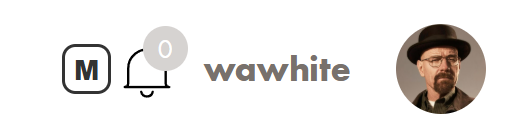
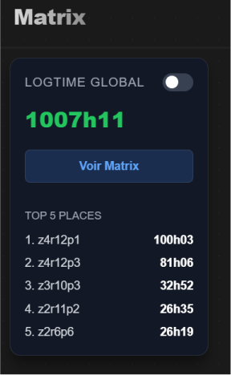

### 🛡️ Protection Anti-TIG (Shop Intra)
Ne vous faites plus piéger au cluster ! L'extension masque et bloque automatiquement l'achat du fameux "Travail d'Intérêt Général" (TIG) dans la boutique de l'Intra 42. Si par malheur vous oubliez de verrouiller votre session en partant en pause, personne ne pourra vous l'acheter dans votre dos pour vous faire une mauvaise blague !

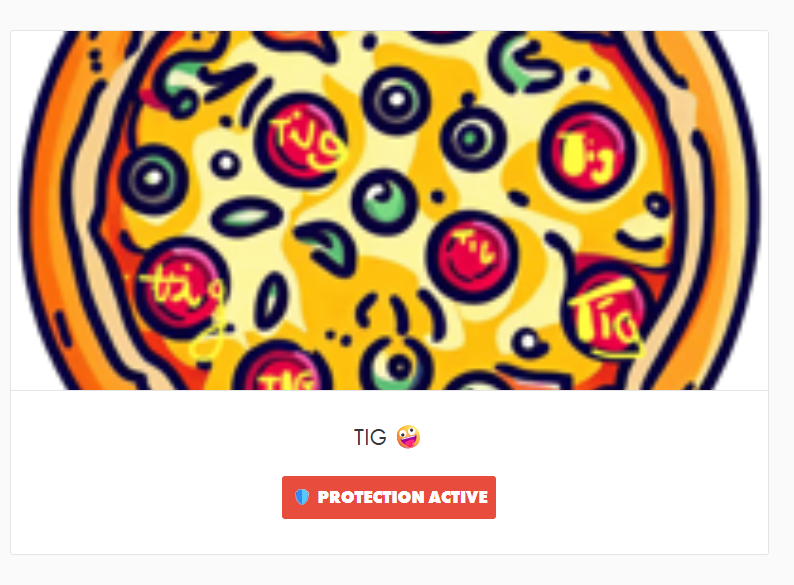

---

## ⚙️ Fonctionnalités Classiques
*   **Planning Personnalisé** : Adaptez vos objectifs quotidiens à votre emploi du temps.
*   **Notifications de Connexion** : Soyez prévenu dès qu'un ami se connecte en cluster.
*   **Calendar Heatmap** : Visualisez votre activité sur l'année.
*   **Matrix View** : Vérifiez l'occupation des clusters en un clic.

---

## 🛡️ Confidentialité
Toutes vos données (clés API, login, amis) sont stockées **localement** dans votre navigateur via `chrome.storage.local`. Aucune donnée n'est envoyée à un serveur tiers.

---

*Amélioré avec passion pour la communauté 42.*
